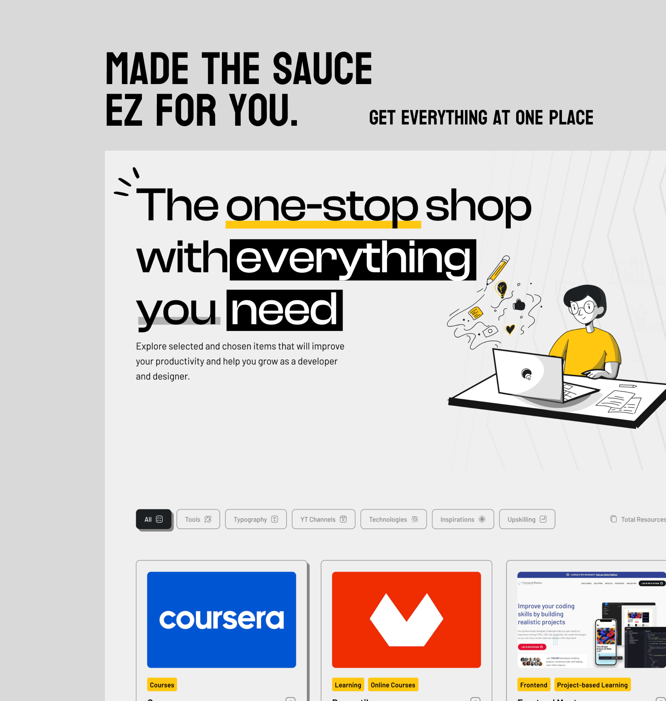

<p align="center">
  
  <h2 align="center">EZSauce</h2>
  <p align="center">A collection of resources to help you grow as a developer and designer<p>
  <p align="center">
    <a href="https://github.com/farhanf7n/ezsauce/blob/master/license">
      
    </a>
    <a href="https://github.com/farhanf7n/ezsauce/stargazers">
      
    </a>
  </p>
</p>
Explore selected and chosen items that will improve your productivity and help you grow as a developer and designer.

<br>


<div style="display: flex; gap: 20px; justify-content: center;">
   <div>
    <h3 align="center">Light Mode</h3>
    
   </div>
   <div>
    <h3 align="center">Dark Mode</h3>
    
   </div>
</div>
<br>

## Current Features

- [x] 🎯 Curated Resources for Developers & Designers
- [x] 🌓 Dark/Light Mode Support
- [x] 🔍 Advanced Search Functionality
- [x] 🏷️ Category-based Filtering
- [x] 📱 Responsive Design
- [x] ⚡ Fast Loading with Image Optimization
- [x] 💨 Smooth Animations & Transitions
      

## 🚀 Getting Started

### Prerequisites

Before you begin, ensure you have the following installed:

- [Node.js](https://nodejs.org/) (v16.0.0 or higher)
- [npm](https://www.npmjs.com/) (v7.0.0 or higher)

### Installation

1. Clone the repository

```bash
git clone https://github.com/farhanf7n/ezsauce.git
```

2. Navigate to the project directory

```bash
cd ezsauce
```

3. Install dependencies

```bash
npm install
```

4. Start the development server

```bash
npm run dev
```

5. Build for production

```bash
npm run build
```

### 🔧 Available Scripts

| Command           | Description                   |
| ----------------- | ----------------------------- |
| `npm run dev`     | Starts the development server |
| `npm run build`   | Builds the app for production |
| `npm run preview` | Preview production build      |
| `npm run lint`    | Runs ESLint                   |

## Use Cases

> Here is the list of common use cases for EZSauce

- 🔍 Looking for development tools? Browse our curated collection without endless Google searches
- 🎨 Need design inspiration? Access carefully selected UI/UX resources in one place
- 📚 Learning new technology? Find comprehensive learning materials and documentation
- 💻 Building a project? Quickly find the right tools and resources to accelerate development
- ⚡ Want to stay productive? Access all essential dev/design resources from a single dashboard

## Who is it for?

> EZSauce is perfect for:

- 👨‍💻 Developers looking for trusted tools and resources
- 🎨 Designers seeking inspiration and design assets
- 🎓 Students learning web development or design
- 👥 Teams searching for project resources
- 🚀 Anyone wanting to boost their development workflow

<!-- CONTRIBUTING -->

## 🤝 Contributing

We love your input! We want to make contributing to EZSauce as easy and transparent as possible, whether it's:

- 🐛 Reporting a bug
- 💡 Submitting a feature request
- 📝 Improving documentation
- 💻 Submitting a fix
- 🌟 Proposing new features
- 💬 Discussing the current state of code

### Steps to Contribute

1. Fork the Project
2. Clone your fork
   ```bash
   git clone https://github.com/your-username/ezsauce.git
   ```
3. Create your Feature Branch
   ```bash
   git checkout -b feature/AmazingFeature
   ```
4. Make your changes
   ```bash
   git add .
   git commit -m 'Add some AmazingFeature'
   ```
5. Push to the Branch
   ```bash
   git push origin feature/AmazingFeature
   ```
6. Open a Pull Request

### Development Process

1. Create an [Issue](https://github.com/farhanf7n/ezsauce/issues/new) for the change you want to make
2. Wait for issue to be approved/discussed
3. Fork the project and create a branch
4. Make your changes
5. Submit a Pull Request
